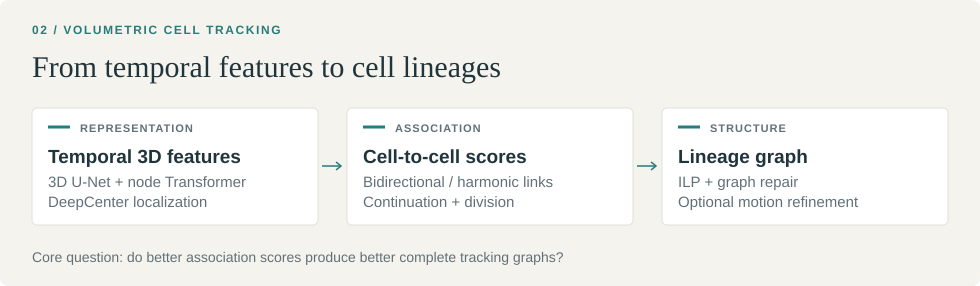

[← All studies](../README.md) &nbsp; / &nbsp; Study 02

# Biohub
### Cell Tracking during Development

| Final rank | Best selected Private score ↑ | Task |
|:---|:---|:---|
| **1,714th / 4,020 teams** | **0.91051** | **3D cell lineages** |

Detecting cells and reconstructing their lineages in volumetric developmental
microscopy. The submitted pipeline combines temporal 3D U-Nets, node
Transformers, an auxiliary DeepCenter model, and graph optimization.

**Key finding.** Better local association scores did not reliably improve the
complete tracking graph. Collective-motion refinement raised the Public score
but reduced Private performance.

[Method](#method) · [Results](#results) · [Experiments](#experiments) · [Code and reproduction](#code-and-reproduction)

## Method

| Component | Model or method | Function |
|---|---|---|
| Spatiotemporal representation and association | Temporal 3D U-Net + node Transformer, using two public checkpoint variants | Extract temporal image features and score cell associations |
| Auxiliary localization | DeepCenter 3D U-Net | Provide a learned cell-center prior |
| Tracking graph | Bidirectional / harmonic association, ILP, and graph repair | Assemble continuation and division relationships |
| Motion refinement | Robust neighborhood-based collective motion | Reassign selected ordinary continuation edges while preserving nodes and division structure |

The neural baseline was adapted from the public
[nusrati/0-940 notebook](https://www.kaggle.com/code/nusrati/0-940), with checkpoint
sources documented in [reproducibility](REPRODUCIBILITY.md). Our research focused
on association, division modeling, temporal features, and the translation of
learned scores into complete tracking graphs.

## Results

| Pipeline | Public | Private |
|---|---:|---:|
| Baseline replay / threshold hedge | 0.94094 | **0.91051** |
| Baseline + collective-motion refinement | **0.94218** | 0.90743 |
| Later native / learned-division / dense route, unselected | 0.938 | 0.904 |

The higher-Public motion variant did not improve Private performance.
Official submission details are in [results](FINAL_RESULTS.md).

## Experiments

| Experiment | Measured result | Interpretation |
|---|---|---|
| NCC continuation | Local graph score 0.92210 → 0.92425 on 32 movies | Better continuation associations, with division recall loss |
| Learned pair residual | NLL 2.108 → 1.226; graph score 0.93323 → 0.91967 | Better local likelihood did not improve global graph decisions |
| Regularized five-frame encoder | Weighted AUC 0.96683 → 0.96835 | Small gain in an intermediate objective |
| Learned / dense route | Graph score 0.91421 → 0.92299 on 199 movies | Useful local stage improvements; official transfer remained weaker |
| Candidate expansion, K500 → K1000 | Graph score unchanged at 0.92066 on 18 selected movies | More candidates did not recover additional scored events |

These panels differ in population and upstream exposure. They are development
comparisons, not interchangeable estimates of unseen performance. In particular,
cross-fitting a residual head does not remove exposure in the upstream detector,
crops, or model selection.

## Code and reproduction

- [Research report](RESEARCH_HISTORY.md): experimental progression and model analysis
- [Results](FINAL_RESULTS.md) and [experiment table](results/research_results.csv)
- [Reproducibility](REPRODUCIBILITY.md)
- [Collective-motion implementation](src/csv_overlay.py)
- [Sources and licenses](THIRD_PARTY_NOTICES.md)

The public implementation reproduces the motion refinement and its synthetic
tests. Full neural inference requires the referenced checkpoints and accepted
notebook versions.
