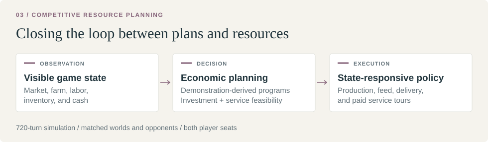

[← All studies](../README.md) &nbsp; / &nbsp; Study 03

# Kaggriculture
### Resource-Constrained Competitive Planning

| Final rank | FlexService Public rating | AdaptiveMilk Public rating |
|:---|:---|:---|
| **Not yet confirmed¹** | **2409.8** | **2163.7** |

Competitive control in a 720-turn farming simulation with shared markets,
limited labor, and coupled production and transport constraints. The submitted
policies combine demonstration-derived programs with current-state economics
and explicit cash-flow feasibility.

**Key finding.** Planning complete production and service programs performed
better locally than narrow market selectors. FlexService scored **677 / 768**
points against **622 / 768** for AdaptiveMilk on the same prospective panel.

¹ No final rank was confirmed in the saved official observation of 2 October 2026, 04:26 UTC. Public skill ratings are not leaderboard positions.

[Method](#method) · [Results](#results) · [Validation](#validation) · [Code and reproduction](#code-and-reproduction)

## Method

| Model or method | Application | Outcome |
|---|---|---|
| Ridge regression | Select among compatible policy branches from legal current-state features | Limited transfer to new world cohorts |
| ExtraTrees | Nonlinear branch selection | Cohort-held-out performance below the fixed candidate |
| Cross-entropy method (CEM) | Optimize market-control parameters through full-game simulation | Small, opponent-dependent gain; not promoted |
| Demonstration-derived production policies | Compile public action programs into state-responsive production and logistics | Basis of the final submitted controllers |
| AdaptiveMilk economic routing | Evaluate later animal investment using visible market and farm state | Submitted policy; 636 / 704 points in its confirmation panel |
| FlexService constrained planning | Evaluate complete paid service tours, wages, feed, delivery, and incremental production | Submitted policy; 677 / 768 points in its confirmation panel |

The final controllers use deterministic routing and economic forecasts.
The learned selectors were research alternatives. Public demonstrations supplied
offline policy parameters; our modules added material feedback, investment
selection, and service planning. Attribution is documented in
[sources](SOURCES_AND_LICENSES.md).

## Results

The submitted policies were compared on a **shared panel of 32 new worlds,
12 opponents, and both seats**:

| Policy | Local points / 768 | Comparison |
|:---|---:|:---|
| **FlexService** | **677** | Constrained service planning |
| AdaptiveMilk | 622 | State-conditioned animal investment |

<strong>Additional confirmation panels</strong>

| Policy | Confirmation panel | Points | Status |
|---|---|---:|---|
| AdaptiveMilk | 32 new worlds × 11 opponents × 2 seats | 636 / 704 | Submitted |
| FlexService | 32 new worlds × 12 opponents × 2 seats | **677 / 768** | Submitted |
| NativeDeadlines | 32 new worlds × 17 opponents × 2 seats | 1055 / 1088 | Local research |
| Committed funding horizon | 64 new worlds × 7 opponents × 2 seats | 843 / 896 | Local research |

The panels differ, so their rates do not directly rank every method.
Committed's 11 additional wins over Flex were all against the earlier
LateFlock policy, exposing a coverage limitation despite its favorable total.

## Validation

Policies were compared in the same worlds against fixed opponents in both
seats. A win contributes 1 point and a draw 0.5. Uncertainty was evaluated
at the world level because seats and related opponent policies are dependent.

## Code and reproduction

- [Research report](RESEARCH.md): model progression, mechanisms, and negative results
- [Results](RESULTS.md): matched comparisons and official observations
- [Reproduction](REPRODUCE.md): exact reconstruction of both submitted policies
- [FlexService code](strategies/flex_service/) and [AdaptiveMilk code](strategies/adaptive_milk/)

Both submitted policies and their inference dependencies are included.
The broader research comparisons also require the original opponent assets.
