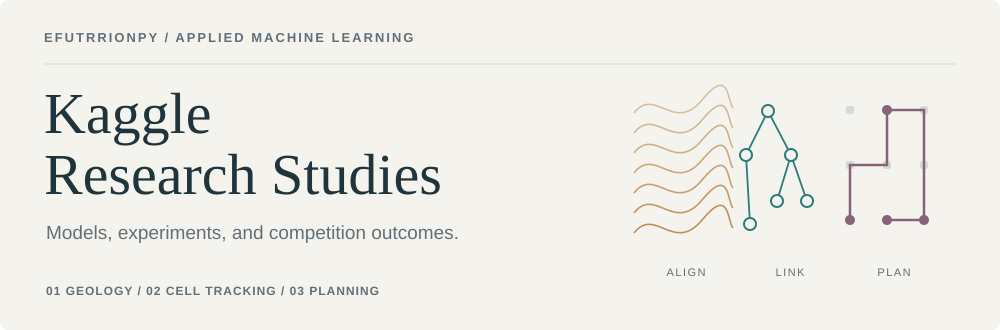

Three competition studies, from model design to measured outcomes. Each report
connects the final system to the experiments that shaped it.

[Geology](ROGII/README.md) · [Cell tracking](Biohub/README.md) · [Competitive planning](Kaggriculture/README.md)

---

### 01 &nbsp; ROGII · Wellbore Geology Prediction

**444th of 6,191 teams · Bronze medal** 
**8.889** Private RMSE · **7.502** Public RMSE

**CatBoost + geological projection + HMM alignment.** A 290-feature regressor
combined with physical path estimates to predict unseen well tails. The final
ensemble beat a stronger Public-scoring candidate on the Private leaderboard,
highlighting the importance of novel-well validation.

[Read the study →](ROGII/README.md) &nbsp; · &nbsp; [Methodology](ROGII/docs/methodology.md) &nbsp; · &nbsp; [Code](ROGII/src/rogii/)

---

### 02 &nbsp; Biohub · Cell Tracking during Development

**1,714th of 4,020 teams · Final Private leaderboard** 
**0.91051** best selected Private score

**Temporal 3D U-Nets + node Transformers + graph optimization.** Experiments
investigated cell associations, division modeling, and collective motion.
Improvements in intermediate learning objectives did not consistently improve
complete lineage graphs; the motion variant improved Public but reduced Private performance.

[Read the study →](Biohub/README.md) &nbsp; · &nbsp; [Experiments](Biohub/RESEARCH_HISTORY.md) &nbsp; · &nbsp; [Code](Biohub/src/csv_overlay.py)

---

### 03 &nbsp; Kaggriculture · Competitive Resource Planning

**Final rank not yet confirmed in the archived evidence** 
**2409.8** FlexService Public rating · **2163.7** AdaptiveMilk Public rating

**Demonstration-derived policies + state-responsive economic planning.**
Controllers explicitly accounted for labor, cash flow, feed, and delivery.
On the same prospective local panel, FlexService scored **677 / 768** points
versus **622 / 768** for AdaptiveMilk.

[Read the study →](Kaggriculture/README.md) &nbsp; · &nbsp; [Results](Kaggriculture/RESULTS.md) &nbsp; · &nbsp; [Code](Kaggriculture/strategies/)

---

Results are from the archived competition evidence. Kaggriculture's latest saved official observation is 2 October 2026, 04:26 UTC; its Public ratings are not ranks. Official scores and local validation estimates are distinguished within each study.
