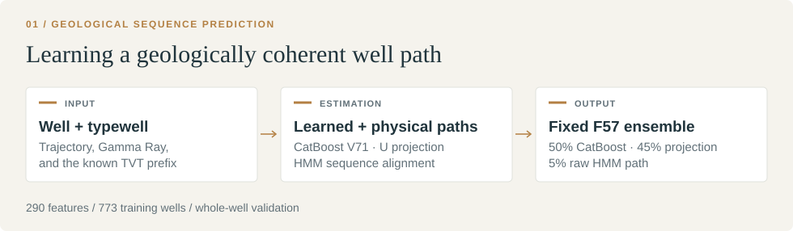

[← All studies](../README.md) &nbsp; / &nbsp; Study 01

# ROGII
### Wellbore Geology Prediction

| Final rank | Private RMSE ↓ | Award |
|:---|:---|:---|
| **444th / 6,191 teams** | **8.889** | **Bronze medal** |

Predicting the unseen True Vertical Thickness (TVT) tail of a horizontal well
from its trajectory, Gamma Ray log, known TVT prefix, and paired typewell.
The final system combines query-local CatBoost regression with geological
projection and sequence alignment.

**Key finding.** The ensemble selected through novel-well validation achieved a
better Private result than the candidate with the stronger Public score.

[Method](#method) · [Results](#results) · [Validation](#validation) · [Code and reproduction](#code-and-reproduction)

## Method



| Component | Method | Role |
|---|---|---|
| Sequence alignment | Particle Filter and HMM | Align horizontal Gamma Ray measurements to the paired typewell and estimate candidate TVT paths |
| Geological context | Fold-isolated neighboring-well features | Supply local surface and spatial information without held-out target leakage |
| Residual learning | XGBoost in earlier experiments; CatBoost V71 in the final model | Learn corrections from trajectory, alignment, uncertainty, and spatial features |
| Physical regularization | Robust degree-four projection in `U = TVT + Z` | Smooth the geological path while accounting for well trajectory |
| Final predictor | Fixed ensemble F57 | Combine learned and physical estimates |

V71 used **290 inference-legal features**: 121 base features and 169 additional
alignment, typewell, trajectory, spatial, Gamma Ray, and diagnostic features.
The final prediction was:

```text
F57 = 0.50 × CatBoost V71 + 0.45 × U projection + 0.05 × raw HMM path
```

## Results

| Submission | Public RMSE ↓ | Private RMSE ↓ |
|:---|---:|---:|
| **F57 · final ensemble** | 7.502 | **8.889** |
| Alternative account submission | **6.449** | 9.565 |

A competing account submission scored 6.449 Public but 9.565 Private. The
visible Public fixture consisted of three wells whose legal input sequences
overlapped training, limiting its usefulness for model selection. F57 was
selected using novel-well validation evidence and achieved the better Private result.

<details>
<summary><strong>Experimental progression · seven research stages</strong></summary>

| Research stage | Representative method | Internal RMSE |
|---|---|---:|
| Baseline | Last-known TVT continuation | 15.9099 |
| Sequence alignment | Particle Filter / typewell Gamma Ray | 12.8638 |
| Spatial modeling | Fold-isolated geological prior | 12.1402 |
| Residual ensemble | Particle Filter + spatial features + XGBoost | 11.1502 |
| Physical projection | Robust `U = TVT + Z` smoothing | 10.5418 |
| HMM combination | HMM / U-projection blend | 10.0325 |
| Final ensemble | F57 | **8.5186** |

These stages used evolving exploratory protocols; the table summarizes the
recorded progression rather than a controlled ablation across every row.

</details>

## Validation

The training data contained **773 horizontal wells and 5.09 million rows**.
Evaluation held out complete wells and scored their native hidden tails using
pooled row-level RMSE. Learned preprocessing, neighboring-well structures, and
residual models were fitted within their respective training folds.

The final 8.5186 internal estimate used a **hybrid cross-fit**: the V71 leg was
cluster-excluded, while the U/HMM leg used complete-well OOF. It is not a
fully leave-cluster-out evaluation of the entire ensemble.

## Code and reproduction

The published reference code covers [alignment](src/rogii/alignment.py),
[physical projection](src/rogii/projection.py), [validation](src/rogii/validation.py),
and [ensemble composition](src/rogii/ensemble.py).
Production CatBoost artifacts and external notebook-derived components require
the original assets; this reference subset is not a complete reproduction of
the Private score.

- [Methodology](docs/methodology.md)
- [Experiment timeline](docs/experiment_timeline.md)
- [Research analysis](docs/postmortem.md)
- [Data access](DATA.md) and [source attribution](THIRD_PARTY_NOTICES.md)

From this folder:

```bash
python -m venv .venv
source .venv/bin/activate
python -m pip install -e ".[dev]"
pytest
python examples/synthetic_demo.py
```
